# SOC Home Lab

## Objective

This home lab emulated a Security Operations Center (SOC) by generating telemetry for security analysis and creating detection and response rules for real-world attack scenarios. This project consisted of weakening a Windows 10 machine's security, generating telemetry with Sysmon, deploying the robust Command and Control (C2) tool, Sliver, and utilizing LimaCharlie to detect and respond to threats. LimaCharlie is a SecOps platform with capablities of Endpoint Detection and Response (EDR), Automated Detection and Response (ADR), telemetry storage, and more.

### Skills Learned

- Deployed LimaCharlie as an endpoint detection and response (EDR) platform
- Created custom Detection & Response (D&R) rules to identify suspicious activity
- Performed command execution, privilege enumeration, and session management within Sliver to emulate attacker behavior
- Simulated realistic attack scenarios to test EDR visibility and response

## Steps

Starting this lab, I set-up and configured a Windows 10 machine, which will be the target and host for LimaCharlie and an Ubuntu server for C2. The first step is to completey disable Windows Defender. I turned off tamper protection as well as the rest of the virus & threat protection settings, then opened up Local Group Policy Editor with the command "gpedit.msc". Here, I turned off Microsoft Defender Antivirus. 

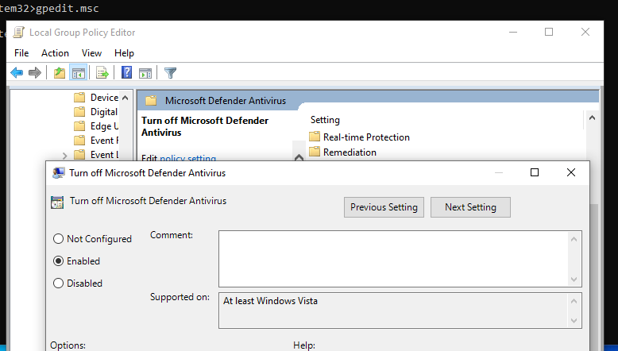

Next, I ran this command in cmd to permanently disable Defender via Registry.

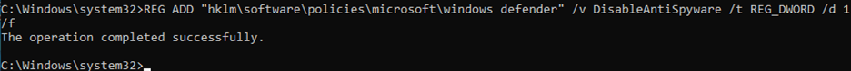

I then boot the system into Safe Mode to disable all Defender services before accessing the registry.

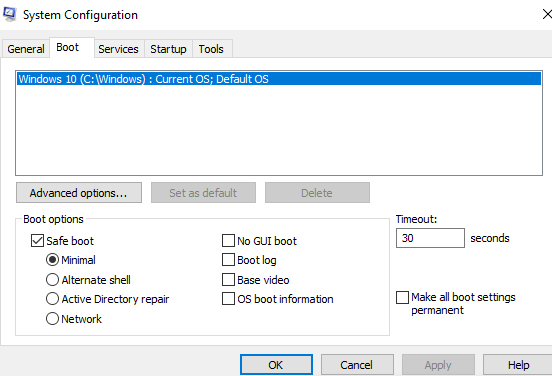

Once in Safe Mode, I opened up Registry Editor and went to HKEY_LOCAL_MACHINE\SYSTEM\CurrentControlSet\Services to disable these services: Sense, WdBoot, WinDefend, WdNisDrv, WdNisSvc, and WdFilter. These are disabled by setting the start value to 4.

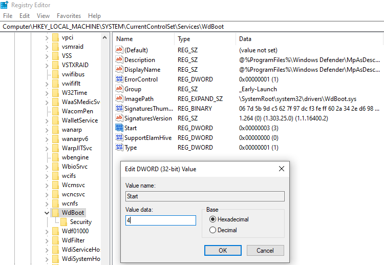

Now that Windows Defender is completely disabled, we can start. 

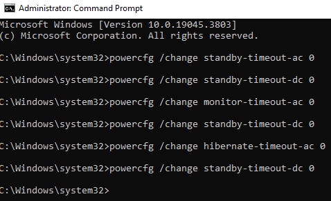

To generate telemetry for LimaCharlie, I installed Sysmon with the SwiftOnSecurity configuration. Then I set up my LimaCharlie account and made an artifact collection rule for the Sysmon logs.

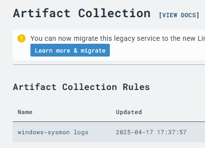

In order to install/configure Sliver easier with copy and paste, I used SSH from my host machine to remotely connect to the Ubuntu machine. Once Sliver was installed, I used the command "generate --http" followed by the IP address of the Ubuntu VM to generate the C2 payload and saved it to the /opt/sliver directory. 

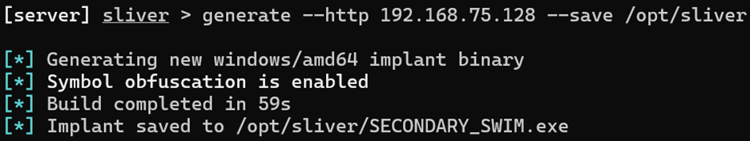

The implant was created and is named "SECONDARY_SWIM.exe". I exited Sliver, moved into the new directory, and used the command "python3 -m http.server 80". This uses Python to start a simple HTTP webserver on port 80 (http). 

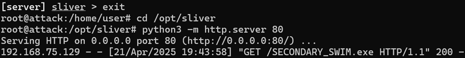

Switching back to the Windows 10 VM, I opened PowerShell and ran this command to download the C2 payload.

I started Sliver again to start the HTTP listener to catch the callback and executed SECONDARY_SWIM.exe on the Windows 10 VM to execute the payload. I then used "sessions" to ensure that I had C2 access. The "use" command followed by the Session ID allows us to directly interact with the C2 session. 

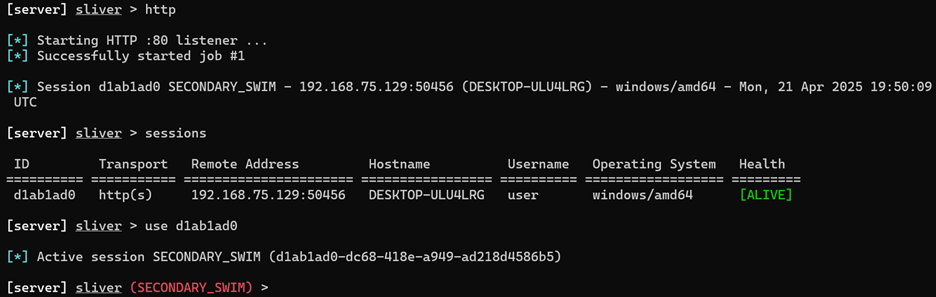

Now would be a good time for reconnaissance, to gather more information on the target system. "Info" details basic info about the session.

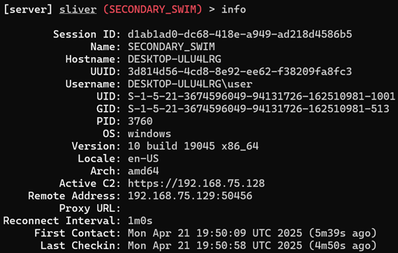

The "getprivs" command shows privilege levels and is valuable to adversaries looking for more attack vectors. Other commands like "netstat" which allow you to check the connections of the target are also very useful.

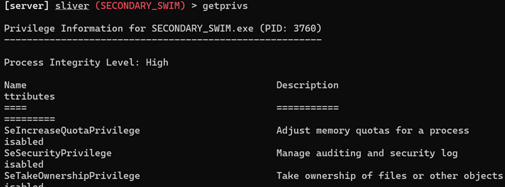

After executing the C2 payload, I went back to LimaCharlie and looked at processes and found the suspicious SECONDARY_SWIM executable. LimaCharlie has VirusTotal built in to verify the integrity of a process by checking its hash. As you can see, VirusTotal doesn't recognize the hash since the payload was just created. In the real-world, if VirusTotal doesn't recognize a file, that doesn't always mean that it is innocent. LimaCharlie also shows a timeline of EDR telemetry that can be filtered and adjusted to your needs, which can be helpful during an investigation. 

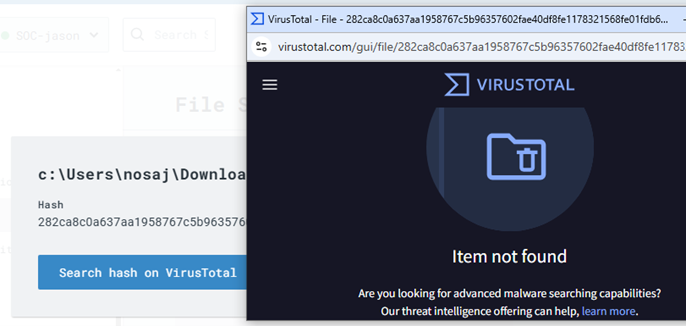

Back on Sliver, I am going to use a common tactic adversaries use, which is stealing credentials by dumping the lsass.exe process from memory. I am able to do this because we have SeDebugPrivilege that I found using "getprivs" earlier. 

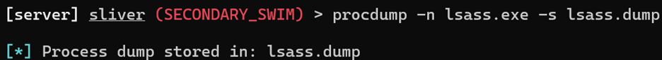

After executing the malicious command, I went to LimaCharlie to see if the EDR detected the relevant telemetry. As you can see, it is marked as a suspicous process.

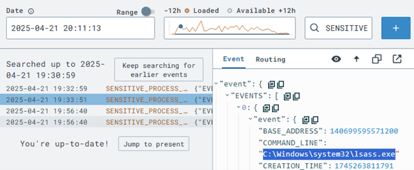

We can set detect and response (D&R) rules to detect this specific action and respond to it accordingly. When credential access occurrs, I am telling LimaCharlie to create a detection named "report". We could also write rules to terminate the process and more.

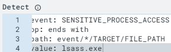 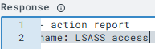

To ensure that these rules work, we can use a feature that tests the event before committing them. The picture below tells us that these new D&R rules work. 

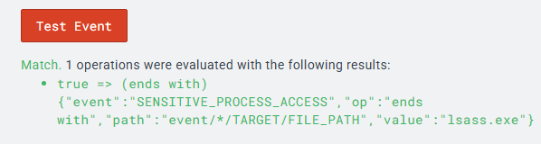

I executed the same lsass dump and went back to detections in LimaCharlie. It detected the threat based off the newly created detection signature.

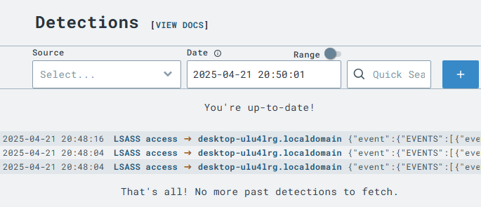
